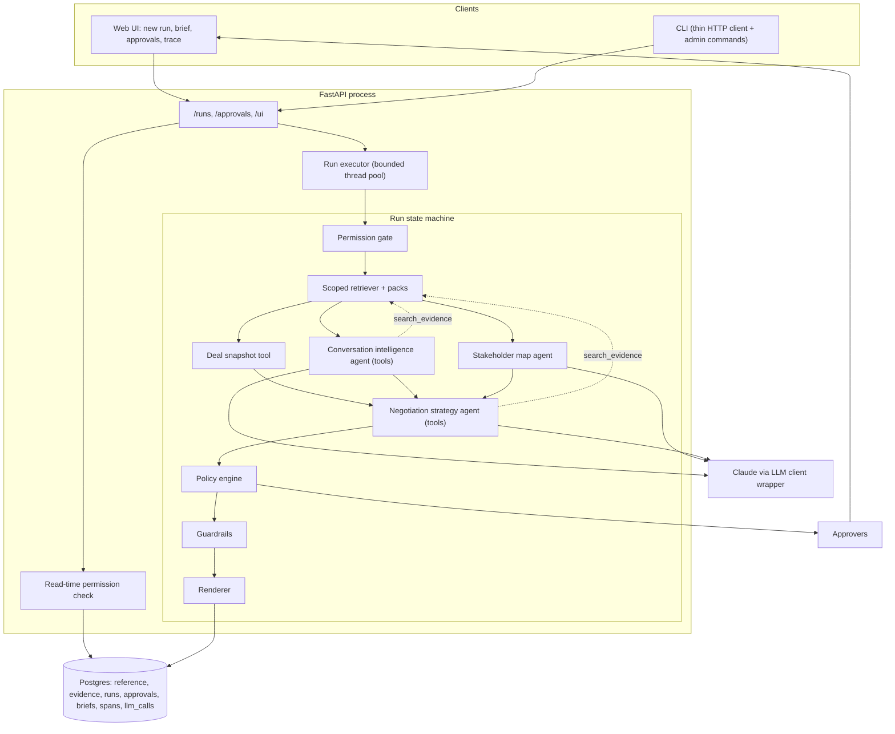

# Build plan: Strategic Deal Intelligence Assistant

This plan turns the reference design (`docs/reference/arch.md`, `docs/reference/sub.md`) into a buildable sequence of milestones, with the review findings applied. Where this plan and the reference docs disagree, this plan wins; the reference docs stay as background for contracts and rationale.

## 1. What we are building

A multi-agent system that takes an opportunity id and a requesting user id, retrieves only the evidence that user may see, runs three LLM agents over it, and produces a nine-section negotiation brief with citations. Sensitive recommendations are routed to human approvers through a web UI. Every step is traced and persisted so briefs can be inspected, replayed, and audited.

Interfaces: FastAPI service, server-rendered web UI (Jinja2 + HTMX), and a Typer CLI. Storage: Postgres 16 (full-text search, optional pgvector). Models: Claude via one client wrapper.

## 2. Changes from the reference design

| Id | Area | Reference design | This plan | Why |
|---|---|---|---|---|
| C1 | Execution | Postgres job queue, worker process, leases, heartbeats (T14) | In-process runner: the API submits runs to a bounded `ThreadPoolExecutor`; runs resume from persisted stage outputs; a startup sweep marks interrupted runs resumable | Same state machine and persistence, a fraction of the code. Queue and workers move to the production-path section |
| C2 | Tracing backend | OpenTelemetry SDK + Jaeger in Compose | Own `Tracer` protocol writing spans to `trace_spans`; JSON export for artifacts; OTel exporter optional (M8) | Postgres is already the audit source of truth; Jaeger adds a service without adding grading value |
| C3 | Agent tools | Agents receive a pre-built pack, no tools | Conversation intelligence and strategy agents run a bounded tool loop with read-only tools bound to `ScopedRetriever` | Makes the agents defensibly agentic while keeping capability-based access |
| C4 | Policy exposure | `PolicySummary` always passed to the strategy agent | Passed only when `scope.policies_allowed`; the policy engine still runs for everyone | Review item 1: users without `policies` access must not receive policy content |
| C5 | Slack access levels | All `OPP-1003` updates `restricted`; validator requires equality | Pricing-bearing updates are `sensitive_pricing`; validator requires "at least the account's minimum level" plus a pricing-keyword lint | Review item 2 |
| C6 | Slack content | Planned updates contain factual errors against the data | Rewritten updates in section 6, each checked against specific calls | Review item 3 |
| C7 | Live demo | Idempotency key and output cache make repeat runs model-free | `--fresh` flag (CLI, API, UI checkbox) bypasses both; idempotency key includes prompt hashes and model config | Review item 4; the interview requires live calls |
| C8 | Unresolvable approvals | Stay `pending` forever; `OPP-1003` never completes | Approvals with no eligible approver get status `escalated`; the run completes when no `pending` approvals remain; the brief labels escalated items prominently | Review item 6; provided permission data stays untouched |
| C9 | Guardrail failures | Drop items; approval wording fails the whole run | Guardrail failures go back through the retry-with-feedback loop first; then drop the item and revalidate; fail the run only if the executive summary cannot be salvaged | Review: over-strict numeric and approval checks |
| C10 | Stakeholder sources | `salesforce`, `gong` | `salesforce`, `gong`, `slack` | Review: off-CRM stakeholder in Slack must reach the map |
| C11 | Pricing visibility | `full`, `partial`, `none` | `visible`, `none` | Review: `partial` reveals that hidden notes exist (policy rule 10) |
| C12 | Approval duplication | One approval per action and one per pricing note | One approval per subject and role; an action citing a pricing note with the same discount shares that note's approval | Review: approvers would see the same decision twice |
| C13 | Rule R7 | Low confidence or conflict | Also fires on missing source data: degraded inputs, or an action whose citations are only subagent-derived with no primary chunk | Policy rule 7 names missing data explicitly |
| C14 | Transactions | Stage transaction spans the LLM call | LLM work outside the transaction; persist output, event, and state in a short transaction | Avoids holding connections for minutes |
| C15 | Plan format | Implementation guides contain full code | This plan specifies contracts, behaviours, and tests; code is written in the repo | Keeps the plan reviewable |
| C16 | `.gitignore` | Whitelist style | Conventional ignore list | New repo; whitelist caused the `docs/` directory to be silently ignored |

Kept from the reference design: Postgres with FTS, typed Pydantic contracts with `extra="forbid"`, the pure permission gate, the single scoped query builder mirrored by a Python predicate, scope assertion before every model call, pricing-sensitivity derivation, policy rules as data, append-only run and approval events, canary-based leakage checks, replay from stored outputs, versioned prompt files, the two-model routing with measured evaluation, and the web UI.

## 3. Target architecture



Run states: `QUEUED → AUTHORIZING → (DENIED | RETRIEVING → ANALYZING → SYNTHESIZING → VALIDATING → (AWAITING_APPROVAL | COMPLETED))`, with `FAILED` reachable from any working state and resumable.

## 4. Repository layout

```text
deal_intel/
  api/            app factory, routes (runs, approvals, ui, health), services, errors, middleware
  ui/             templates/ (base, new_run, brief, approvals, trace, partials/), static/ (htmx, css)
  cli.py          Typer app; cli_client.py (httpx), cli_output.py (exit codes, printing)
  config.py       Settings (pydantic-settings)
  contracts/      access, reference, evidence, llm, guardrails, agents/*, runs, approvals, brief, api, tracing
  permissions/    gate, lookups, scope predicates, read-time checks
  retrieval/      tsv parsing, reference loader, chunkers/, ingest, sensitivity, scoring, retriever, slack_dataset
  llm/            client protocol, anthropic client, fake client, routing, cost, output cache, tool loop
  agents/         base harness, tools, deal_snapshot, conversation_intelligence, stakeholder_map,
                  negotiation_strategy, prompts/<agent>/v1.md
  orchestration/  runner, stages, persistence, executor
  policy/         facts, rules, engine, eligibility
  guardrails/     validators, text helpers, render checks, canaries
  rendering/      sections, labels, markdown, brief (render/store/replay), approved_language/
  observability/  tracer protocol, Postgres span sink, JSON logging, secret filter
  evaluation/     metrics, report
  db/             base, session, models/, migrations/ (Alembic)
scripts/          generate_slack_updates.py, record_fixtures.py, export_artifacts.py, evaluate.py
tests/            unit/ contract/ regression/ safety/ live/ fixtures/
artifacts/        live run outputs
docs/             architecture.md, technical-overview.md, security.md, deliverables.md, diagrams/, reference/
synthetic_data/   provided data + slack/account_team_updates.tsv
docker-compose.yml  Dockerfile  Makefile  pyproject.toml  uv.lock  alembic.ini  .env.example
```

## 5. Milestones

Each milestone ends with `make check` green and a commit (commits need your go-ahead each time). Rough effort assumes one developer with the agent.

| Milestone | Outcome | Effort |
|---|---|---|
| M0 Foundations | Runnable skeleton, Postgres, migrations, health endpoints | 0.5 day |
| M1 Data, permissions, retrieval | Evidence ingested with access metadata; scoped retrieval proven by tests; Slack dataset generated | 1.5 days |
| M2 LLM harness and tracing | One client wrapper, fake client, tool loop, validators, cost, spans | 1 day |
| M3 Agents | Snapshot tool and three agents producing validated outputs; live fixtures recorded | 1.5 days |
| M4 Orchestration, policy, rendering | End-to-end runs with approvals, guardrails, versioned briefs, replay | 1.5 days |
| M5 API, UI, CLI | All interfaces over the same services | 1.5 days |
| M6 Safety and evaluation | Injection, leakage, verbal-approval, regression, metrics | 1 day |
| M7 Live artifacts and documentation | Submission-ready artifacts, docs, diagrams, demo script | 1 day |
| M8 Optional | Hybrid retrieval, grounding judge, OTel exporter | as time allows |

### M0 Foundations

Reference: T01, minus Jaeger and worker.

Tasks:
1. `pyproject.toml` (package `deal_intel`, Python 3.12), dependencies pinned with `uv`: fastapi, uvicorn, pydantic, pydantic-settings, sqlalchemy, alembic, psycopg[binary], pgvector, anthropic, typer, jinja2, python-multipart, httpx; dev: pytest, ruff. `uv.lock` committed.
2. Package skeleton per section 4; `config.py` with `Settings` (fails fast without `DATABASE_URL`); `db/session.py` with `session_scope()`; Alembic baseline reading the URL from settings.
3. `docker-compose.yml`: `postgres` (`pgvector/pgvector` pinned pg16 tag, named volume, init script creating `deal_intel_test`, port bound to 127.0.0.1) and `app` (non-root image, uvicorn, mounts `synthetic_data`).
4. `Makefile`: `up`, `down`, `migrate`, `ingest`, `generate-slack`, `test`, `lint`, `check`, `lock`.
5. `.gitignore` (conventional), `.env.example` (names and placeholders only), ruff config with the `S` rules, pytest config with a `live` marker deselected by default.
6. `GET /healthz` and `GET /readyz` (the latter runs `SELECT 1`).

Done when: `make up` then `curl localhost:8000/readyz` returns 200; `make migrate` is idempotent; `make check` passes; test fixture migrates the test database once per session and truncates between tests.

Approval checkpoints: `brew install uv`, `uv python install 3.12`, `uv add ...`, `docker compose up` (creates local containers and a volume).

### M1 Data, permissions, retrieval

Reference: T02 to T06, with C5, C6, C11.

Tasks:
1. **Reference loader** (T02). Row contracts for users, accounts, opportunities, contacts, pricing notes; TSV parser that reports file and line on validation errors; comma-list and boolean parsing in validators; idempotent upsert by natural key; `deal-intel ingest` loads reference tables.
2. **Permission gate** (T03). `authorize(session, user_id, opportunity_id) -> Allowed | Denied`, with pure `decide(user, opportunity, account)`. Input validated before any lookup. Reason codes `UNKNOWN_USER`, `UNKNOWN_OPPORTUNITY`, `ACCOUNT_NOT_ALLOWED`, `RESTRICTED_ACCOUNT`; one external message. Account membership checked before restriction. `Denied` has no field that can hold account data. `AccessLevel` ordered `standard < restricted < sensitive_pricing` with explicit comparison methods.
3. **Slack dataset** (T06, rewritten per section 6). Authored updates in `retrieval/slack_dataset.py`; validator checks chronology (after the latest call of the opportunity, before close), account match, access level at least the account minimum, pricing keywords (`discount`, `reduction`, `concession`, `%`) forcing `sensitive_pricing`, no `@`, no phone-like digit groups, no tabs or newlines. Writes `synthetic_data/slack/account_team_updates.tsv`; golden labels in `tests/fixtures/slack_golden.json`. `synthetic_data/README.md` gains a short "how it is produced" note.
4. **Evidence ingestion** (T04). `evidence_chunks` and `ingest_snapshots` tables; one pure chunker per source; chunk ids and citation strings exactly as in the reference table; transcript windows of six turns with one-turn overlap and tail merge; Gong participants resolved to "Name, Title"; contacts never carry email or phone; pricing sensitivity rule (restricted opportunity, or approval not `not_required`, or high risk); snapshot id from the file manifest hash; ingest in one transaction.
5. **Scoped retriever** (T05). `ScopedRetriever(session, scope)` rejects anything but an `AccessScope`; one private predicate builder (snapshot, account or policy, opportunity or null, source types intersected with scope, permitted levels, sensitive pricing flag); `list()`, `search()` with `websearch_to_tsquery` + `ts_rank_cd` × reliability × recency (reference date = latest in-scope event date); `build_pack()` with search hits tiered above baseline and a token budget; `evidence_hash()`; `RetrievalRecord` for every call; deterministic tie-breaking by chunk id. `permissions/scope.py` mirrors the predicates in Python.

Done when:
- Gate matrix (6 users × 3 opportunities) matches the reference table, including `USR-5007/OPP-1001` narrow scope and `USR-5004/OPP-1003` `ACCOUNT_NOT_ALLOWED`; a spy session proves malformed input touches no lookup; a serialised `Denied` contains no "Eclipse", "BioMaterials", or "ACC-2003".
- Chunk counts: 27 Gong summaries, at least 9 transcript windows, 15 contacts, 5 pricing, 10 policy rules, 3 opportunities, 3 accounts, 9 Slack.
- Access levels: `PN-4004`/`PN-4005` and `SLK-1003-01`/`-02` are `sensitive_pricing`; `SLK-1003-03` is `restricted`; `PN-4001`..`PN-4003` are `standard`.
- For every allowed pair, every row returned by `list()` satisfies the Python predicate, and the Python predicate over the whole table selects exactly those rows.
- `USR-5007/OPP-1001` retrieves no `slack`, `pricing`, or `policies` chunk; `USR-5003/OPP-1003` search for "discount concession procurement" ranks `pricing:PN-4004` in the top five and a `CALL-027` window in the top ten (`ts_rank_cd` scores term proximity, and CALL-027 spreads the three terms across turns); "verbally okayed discount" ranks `slack:SLK-1003-02` in the top three.
- Ingest twice: same snapshot id, no new rows.

### M2 LLM harness and tracing

Reference: T07, T08, T21 (tracer part pulled forward), with C3, C7, C9.

Tasks:
1. **Tracer first.** `observability/tracing.py`: `Tracer` protocol, `NoopTracer`, `PostgresTracer` writing `trace_spans` (insert on start, update on end, short sessions, errors swallowed into one log line). Attribute whitelist; string values capped at 512 characters; evidence text can never be an attribute. JSON logging with `run_id` and `span_id`; secret-pattern filter.
2. **Client wrapper.** `LlmRequest`, `LlmResult`, `LlmUsage` contracts; routing by role (`extraction` → `MODEL_EXTRACTION`, `strategy` → `MODEL_STRATEGY` with thinking and effort settings); price table in settings, unknown model raises; `llm_calls` row per provider call with `run_id` and `span_id`; output cache keyed by agent, prompt hash, model, and input hash, skipped when `request.fresh`.
3. **Tool loop.** `llm/tool_loop.py` drives a bounded conversation: the model may call read-only tools up to `MAX_TOOL_CALLS` (default 4) and then must return the structured output. Tools are plain Python callables with Pydantic argument models; the loop executes them, returns results as framed evidence, and records every call as a `tool` span. The final output is parsed into the agent's output model.
4. **Anthropic implementation.** The only module importing the SDK. Confirm current model ids, structured-output mechanism, thinking and effort parameters, and tool-use format against the Anthropic docs at build time, and keep those specifics inside this module.
5. **Fake client.** Serves scripted responses from `tests/fixtures/llm/<agent>/<input_hash>.json`, where a fixture is a list of turns (tool calls, then final output), so tool loops replay deterministically. `RECORD_FIXTURES=1` makes the real client write the same format. `fail_agents` option for degraded tests.
6. **Validators** (T08). Citation validity (against pack chunks plus chunks returned by tools during this call), numeric grounding with normalisation (`$4,217,500`, `4217500`, `$4.2M`, `4.2 million` treated as the same figure within the stated precision; ISO dates and bare years excluded on both sides), verbatim quote check, name and contact-id check, list bounds. Each validator returns `GuardrailResult`s and a list of feedback messages.
7. **Retry policy** (C9). The harness retries up to two times on schema errors or guardrail feedback, sending the specific failures back to the model. After retries, offending items are dropped, the output is revalidated against its contract, and a guardrail record is kept.

Done when: fixture round-trip, schema-failure retry, guardrail-feedback retry, tool loop replay, cache hit and `fresh` bypass, cost arithmetic, refusal handling, and "no evidence text in any span" tests pass; one `live` smoke test parses a two-field schema with non-zero usage.

Approval checkpoint: the live smoke test calls the Anthropic API with your key and spends a few cents.

### M3 Agents

Reference: T09 to T12, with C3, C4, C10, C11.

Common harness (`agents/base.py`): `AgentSpec` (name, prompt version, output model, model role, source types, budget, queries, tools, max tokens, empty output), `build_agent_pack()`, `frame_evidence()` (escapes closing tags so a chunk cannot break its wrapper), `assert_pack_in_scope()` before every model call, `run_agent()` with the retry policy from M2. Prompts are versioned files; their hashes go on stage outputs and spans.

Read-only tools (`agents/tools.py`), bound to the run's `ScopedRetriever`:
- `search_evidence(query: str, source_types: list[SourceType] | None, k: int ≤ 8)` returns framed chunks with ids.
- `get_evidence(chunk_ids: list[str] ≤ 8)` returns in-scope chunks by id; out-of-scope or unknown ids return "not found" without distinguishing the two.

Agents:
1. **Deal snapshot tool** (deterministic, T09). Opportunity and account copied verbatim; pricing notes only through the scoped retriever; `pricing_visibility` is `visible` or `none`; citations for every block; no import of the LLM package (asserted in a subprocess test).
2. **Conversation intelligence** (extraction model, tools enabled). Sources `gong`, `slack`. Output: goals, drivers, objections, competitor mentions, urgency (optional), commitments, action items, conflicts, missing, review notes. Conflicts are surfaced, never resolved. Instructions inside evidence are reported in `review_notes`, never followed.
3. **Stakeholder map** (extraction model, single call). Sources `salesforce`, `gong`, `slack`. Fixed role vocabulary; vendor speakers excluded; unmatched speakers and off-CRM people listed; name verification drops invented people.
4. **Negotiation strategy** (strategy model, tools enabled). Input: snapshot, findings, stakeholder map, scope flags, degraded inputs, and `PolicySummary` only when `scope.policies_allowed`. Output: executive summary (3 to 6 cited sentences), negotiation state, next actions with owner role, rationale, sensitivity tags, proposed values, `customer_facing`, confidence; missing information; review warnings. Post-checks: approval-assertion wording and customer-facing leak wording go through the retry policy (C9); a degraded input is always named in review warnings.

Done when (fake client, fixtures recorded live for the three authorised demo pairs):
- Every cited id exists in the pack or tool results; stakeholder names all occur in evidence; no vendor speaker in any map.
- `OPP-1002` findings contain a conflict citing `slack:SLK-1002-02` and a Gong or Salesforce chunk; the `OPP-1002` stakeholder map lists the off-CRM site IT lead from `SLK-1002-01`.
- `OPP-1003` findings put `SLK-1003-02` in conflicts, never in commitments; strategy has a pricing action with `discount_pct` 12 or 18 and `customer_facing = false`.
- `USR-5007/OPP-1001` strategy context has no `PolicySummary`.
- A crafted pack with an out-of-scope chunk raises `ScopeViolation` with zero model calls; empty packs make zero model calls.

Approval checkpoint: fixture recording makes live calls for three scenarios × three agents.

### M4 Orchestration, policy, rendering

Reference: T13, T15, T16, T17, with C1, C8, C12, C13, C14.

Tasks:
1. **Run persistence** (T13). Tables `runs`, `run_events` (append-only), `stage_outputs` (unique on run, stage, attempt). `evidence_hash` stored at retrieval; idempotency key = opportunity, user, evidence hash, prompt hashes, and model config; `fresh` runs skip the lookup.
2. **Runner.** Stage order: authorize, retrieve, deal snapshot, conversation intelligence and stakeholder map in parallel (two threads, separate sessions), strategy, policy, guardrails, render. Model work happens outside transactions; each stage persists output, event, and state in one short transaction (C14). Subagent failure marks the run degraded and continues; strategy failure, scope violation, or budget overrun fails the run. Resume creates a new attempt and skips stages with successful outputs. Denied runs stop after authorize with no retrieval rows.
3. **Executor** (C1). `orchestration/executor.py` holds a bounded `ThreadPoolExecutor` owned by the app lifespan; `submit(run_id)`; on startup, runs left in working states are marked `FAILED` with `INTERRUPTED` so they can be resumed explicitly.
4. **Policy engine** (T15). Facts from next actions and permitted pricing notes; rules R1 to R7 as data, thresholds from settings (the same fields the strategy prompt uses); R7 includes missing source data (C13). Approvals keyed by subject and role (C12). Eligibility: role mapping, account membership, access level at least the brief's. No eligible approver → status `escalated` (C8). Users who cannot request approvals get labelled recommendations and no approval rows. `decide()` locks the row, checks eligibility, appends an event, re-renders, and completes the run when no `pending` approvals remain. Expiry sweep runs on API startup and before listing approvals.
5. **Render-time guardrails** (T16). Customer-facing language lint (concession phrases need an approved status; internal workflow terms never allowed); approval-consistency check; canary set built from out-of-scope chunks; canary scan over rendered Markdown and JSON, denial payloads, API bodies, and span attributes. Leak incidents store a hash of the canary, never the value.
6. **Renderer and replay** (T17). `Brief` contract with one typed field per section; Markdown with the nine headings in order; citations in the standard format on every claim line; Source Evidence lists each cited chunk once; labels `[PENDING APPROVAL: <role>] INTERNAL ONLY`, `[APPROVED by <user> on <date>]`, `[REJECTED]`, `[ESCALATED: no eligible approver for <role>]`, `[APPROVAL EXPIRED]`, `[REQUIRES APPROVAL; you are not permitted to request it]`; approved customer language from per-rule templates, then linted; `max_access_level` from cited chunks; replay writes a new version with byte-identical body.

Done when:
- `USR-5001/OPP-1001` completes or awaits a `human_reviewer` approval for the pilot-sequencing conflict; `USR-5003/OPP-1003` reaches `AWAITING_APPROVAL` with a `deal_desk` approval eligible to `USR-5005` and `sales_leader` and `legal` approvals `escalated`; after `USR-5005` decides every pending item, the run is `COMPLETED` and brief v2 shows the new labels.
- `USR-5007/OPP-1003` ends `DENIED` with zero retrieval rows, and `run_events.detail` holds only the reason code.
- Forced subagent failure gives a degraded completed run with a warning; forced strategy failure gives `FAILED`; resume re-runs only the failed stage (call counts prove it).
- `PN-4004` triggers R1, R2, R3 even when no action mentions it; an 18% action citing `PN-4004` shares its approval.
- Canary scans for `USR-5007/OPP-1001` and `USR-5007/OPP-1003` find nothing; replay twice gives identical Markdown.

### M5 API, UI, CLI

Reference: T18, T19, T20, with C7.

Tasks:
1. **API** (T18). `POST /runs` (`{opportunity_id, user_id, fresh}`) returns 202; `GET /runs/{id}`, `/brief?format=md|json`, `/trace`, `POST /runs/{id}/replay`, `POST /runs/{id}/resume`, `GET /approvals`, `POST /approvals/{id}/decision`, health. Read-time check: requester, or a user whose own scope covers the account at the brief's level; unauthorised and unknown both return the same 404. Trace redaction for readers below the brief's level. Stable error body with request id; no stack traces; body size limit.
2. **Web UI** (T19, kept and extended). Server-rendered from the `Brief` JSON with autoescaping and a strict CSP; vendored, pinned HTMX; works without JavaScript.
   - "Viewing as" user selector (simulated identity, shown on every page).
   - New run page: opportunity and user selectors, "fresh run (live model calls)" checkbox, live status polling until a terminal state.
   - Brief page: nine sections, citations, approval labels, Confidence and Review Warnings highlighted near the top, degraded flag, cost and tokens by agent, version history, replay button.
   - Approvals page: pending and escalated items with recommendation, rationale, rule ids, proposed values, evidence excerpts; approve and reject with a note via HTMX row swap.
   - Trace page: span tree with kind, name, status, duration, tokens, cost; evidence ids only.
3. **CLI** (T20). Thin HTTP client: `generate --opp --user [--wait] [--fresh] [--json]`, `runs show|trace|replay|resume`, `approvals list|decide`; in-process admin commands `ingest` and `generate-slack`. Exit codes 0, 2, 3, 4, 5. Run commands never import database or orchestration modules.

Done when: HTTP tests for every endpoint and permission case from T18; UI tests for rendering, escaping of a `<script>` payload, CSP header, HTMX and no-JS approve flows, and "USR-5007 sees the generic not-found page"; CLI tests through the in-process ASGI transport; manual browser pass through the four demo scenarios.

### M6 Safety and evaluation

Reference: T22, T23.

Tasks:
1. Five injection fixtures (instruction override, fake approval, request for restricted sources, exfiltration request, instruction hidden in a transcript turn) run against each agent, including through the tool loop; assertions: no forbidden phrase, no approval claim, a review note present. Live duplicates marked `live`.
2. Leakage suite over four scenarios (`USR-5007/OPP-1003`, `USR-5004/OPP-1003`, `USR-5007/OPP-1001`, `USR-5001/OPP-1001`): zero canary hits in briefs, API bodies, UI pages, denial payloads, and spans.
3. Verbal-approval test: `SLK-1003-02` yields a conflict and a review warning, never an approved status or approved-language rendering.
4. Scope-assertion test: a monkeypatched predicate builder that drops the level filter causes `ScopeViolation` before any model call.
5. Goldens and metrics: citation validity, grounded-number rate, section completeness, approval routing accuracy (expected rules per scenario), denial correctness, degraded rate, cost and tokens per brief, guardrail drops by type; committed baseline with tolerance; Slack golden keywords asserted in their expected sections.

Done when `pytest tests/safety tests/regression` passes and `scripts/evaluate.py --from-fixtures` prints the metrics table.

### M7 Live artifacts and documentation

Reference: T24, T25.

Tasks:
1. Live runs with `RECORD_FIXTURES=1` and `--fresh`: `USR-5001/OPP-1001`, `USR-5002/OPP-1002`, `USR-5003/OPP-1003` then `USR-5005` approves one item and rejects one, `USR-5007/OPP-1003` denied.
2. `scripts/export_artifacts.py` writes, through the API services as the requesting user: brief Markdown and JSON per version, trace JSON, LLM call summary, approvals before and after, run record for the denial. `artifacts/<date>/README.md` lists files, model settings, total cost, commit hash. Screenshots of the UI flows.
3. Docs: `README.md` (setup, configuration, supported models and parameters, the four demo commands and UI walkthrough, tests, evaluation), `docs/architecture.md` (reference design revised with section 2 of this plan), `docs/technical-overview.md` (with measured cost, latency, and evaluation numbers, and the production path), `docs/security.md`, `docs/deliverables.md` (assignment item → file), diagrams (logical and deployment, Mermaid sources and SVG exports).
4. Demo script and a 15-minute presentation outline (section 8).

Done when a clean clone following the README reproduces all four scenarios, and every deliverable row points at an existing file.

Approval checkpoint: live runs spend model tokens (expected under a few dollars total; measured and reported).

### M8 Optional

- Hybrid retrieval (T26): deterministic hashing embeddings for tests, provider slot for a real embedding model, reciprocal rank fusion over two already-scoped lists, top-five hit-rate comparison. Labelled cases include `USR-5003/OPP-1003` "discount concession procurement" expecting a `CALL-027` window (lexical ranks it seventh).
- Grounding judge (T27): advisory support labels for summary sentences and actions, surfaced in warnings.
- OTel exporter behind configuration, using the existing `Tracer` protocol.

## 6. Slack-style updates (corrected)

All rows carry `synthetic_notice = "SYNTHETIC: generated for the exam dataset; no real people, companies, or data"`. Channels: `#acct-northstar`, `#acct-meridian`, `#acct-eclipse-restricted`.

| Id | Date | Role | Level | Kind | Content | Grounding |
|---|---|---|---|---|---|---|
| `SLK-1001-01` | 2026-04-27 | AE | standard | reinforces | Recap of the 04-24 document review: no new commercial asks, legal only needs the data-retention policy excerpt, procurement expects the signature package next; owner matrix and payment schedule still due 04-28 | `CALL-008`, `CALL-009`, `PN-4002`; worded without "discount" so the row stays standard under the pricing-keyword rule |
| `SLK-1001-02` | 2026-04-29 | CSM | standard | adds context | Iris Calder is out of office 05-04 to 05-08; her deputy can receive the signature package but cannot sign; finance approval of the payment schedule needs to land before 05-04 or signature slips toward the 05-17 close | new; extends the "finance approval of payment schedule" gap from `CALL-008` |
| `SLK-1001-03` | 2026-05-02 | SE | standard | conflicts | Pavel Stone now wants the two legacy-appliance sites migrated before the pilot sites, contrary to the pilot-first sequencing from the March planning session; unclear whether Marco Devlin agrees | contradicts `CALL-002` |
| `SLK-1002-01` | 2026-04-28 | SE | standard | adds context | Clara Esteves says plant readiness sign-off for the first cutover factory sits with a site IT lead who is not in the contact list; they asked for on-site support during cutover week | new stakeholder, absent from `contacts.tsv` |
| `SLK-1002-02` | 2026-05-01 | AE | standard | conflicts | "Proof closeout pack went to Julian Maro's office last week, I consider that item closed" | contradicts `CALL-018` (export retest and incident owner map still required) and the CRM next step due 05-08 |
| `SLK-1002-03` | 2026-05-04 | CSM | standard | reinforces | Lena Frost reconfirmed finance approves only a staged payment tied to acceptance of the closeout pack, with capped enablement | `CALL-017`, `CALL-018`, `PN-4003` |
| `SLK-1003-01` | 2026-04-29 | AE | sensitive_pricing | reinforces | Darin Holt followed up in writing and still wants the larger reduction or a shorter term modelled; reminded him the aggressive option is unapproved and internal-only | `CALL-021`, `CALL-027`, `PN-4004` |
| `SLK-1003-02` | 2026-05-03 | AE | sensitive_pricing | conflicts | "Heard from a colleague that Deal Desk verbally okayed a mid-teens discount for Eclipse, nothing in writing yet" | contradicts `PN-4004`/`PN-4005` pending status and `CALL-027` ("a larger discount is not approved") |
| `SLK-1003-03` | 2026-05-06 | CSM | restricted | adds context | Priya Sato's office set the board sponsor review for 05-21, so the internal package comparison must be final by 05-19; research IT exception-owner confirmation from Mateo Ruan is still outstanding | new date; reinforces the missing item from `CALL-027` |

The mix of levels inside `OPP-1003` is deliberate: it proves the retriever filters per row, not per opportunity.

## 7. Configuration

| Variable | Default | Purpose |
|---|---|---|
| `ANTHROPIC_API_KEY` | none | Model access; set in the shell, never committed |
| `DATABASE_URL`, `TEST_DATABASE_URL` | local Compose URLs | Postgres |
| `MODEL_STRATEGY`, `MODEL_EXTRACTION` | `claude-sonnet-4-6`, `claude-haiku-4-5-20251001` | Routing |
| `STRATEGY_EFFORT` | `medium` | Strategy agent reasoning effort |
| `MAX_TOOL_CALLS` | `4` | Tool loop bound per agent call |
| `RUN_INPUT_TOKEN_BUDGET` | `250000` | Hard cap per run (raised after a live Sonnet + tool-loop run billed 191k input tokens) |
| `DAILY_COST_BUDGET_USD` | `20` | Executor refuses new runs above this |
| `RUN_EXECUTOR_WORKERS` | `2` | Concurrent runs in the API process |
| `APPROVAL_EXPIRY_HOURS` | `168` | Pending approvals expire after this |
| `EMBEDDINGS_ENABLED` | `false` | Hybrid retrieval (M8) |
| `LLM_CLIENT` | `anthropic` | `fake` for tests |
| `RECORD_FIXTURES` | `0` | Write fixtures from live calls |
| `APP_ENV`, `LOG_LEVEL` | `dev`, `INFO` | Runtime |

## 8. Demo script (interview)

1. UI as `USR-5001`: fresh run on `OPP-1001`. Walk the brief: snapshot figures copied from Salesforce, cited claims, the `SLK-1001-03` pilot-sequencing conflict in Confidence and Review Warnings, the out-of-office context from `SLK-1001-02` in Missing Information or Next Actions.
2. Trace page for that run: agent calls, tool calls, retrievals, guardrail results, tokens, cost.
3. UI as `USR-5003`: fresh run on `OPP-1003`. Pending Deal Desk approval, escalated sales-leader and legal approvals, internal-only labels, the "verbally okayed" update surfaced as a conflict.
4. Switch to `USR-5005`: approve the Deal Desk item, reject another; brief v2 shows labels and templated customer-safe language.
5. Switch to `USR-5007`: request `OPP-1003`; generic denial; show the denied run's two-span trace and the leakage test output.
6. CLI: `deal-intel generate --opp OPP-1002 --user USR-5002 --wait --fresh`; show the `SLK-1002-02` conflict and the off-CRM stakeholder.
7. Close with metrics from `scripts/evaluate.py`, cost per brief, and what breaks first in production.

## 9. Risks and mitigations

| Risk | Mitigation |
|---|---|
| Model API details (structured outputs, thinking, tool format) differ from the reference docs | Confirm in M2 against current docs; all specifics live in `llm/anthropic_client.py` |
| Tool loops make runs less deterministic | Tool calls recorded in fixtures; bounded call count; deterministic retrieval; tests replay full turn sequences |
| Fixtures break whenever prompts or data change | `scripts/record_fixtures.py` re-records in one command; goldens compare structure and citations, not free text |
| Strict guardrails gut briefs | Feedback retries before drops; drop counts tracked as a metric with a baseline |
| Live demo latency | Opus call dominates; show the trace while it runs; `fresh` runs of the other scenarios pre-warmed only for the prompt cache |
| Time overrun | M8 is optional; UI polish comes after M6; the CLI covers every scenario if the UI slips |

## 10. Open questions

1. Model ids and whether the Opus-class model is worth its cost for strategy: decided by the M6 evaluation, comparing two-model routing with a single model at low effort.
2. Whether to add a clearly synthetic legal approver (separate config, not the provided TSV) so the legal path can be demonstrated end to end, or keep legal approvals `escalated`.
3. Whether hybrid retrieval (M8) is enabled for the submission, decided on the labelled-query comparison.
