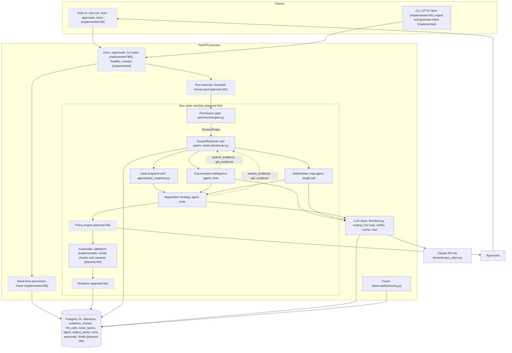
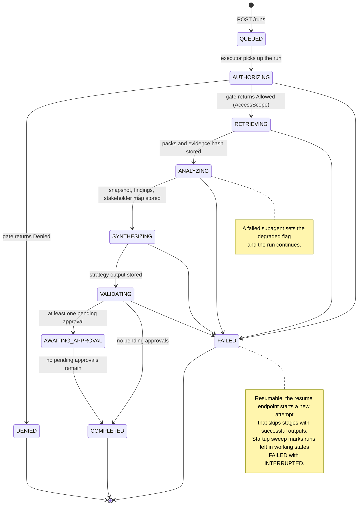
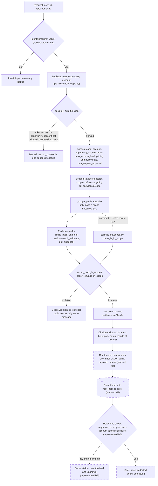
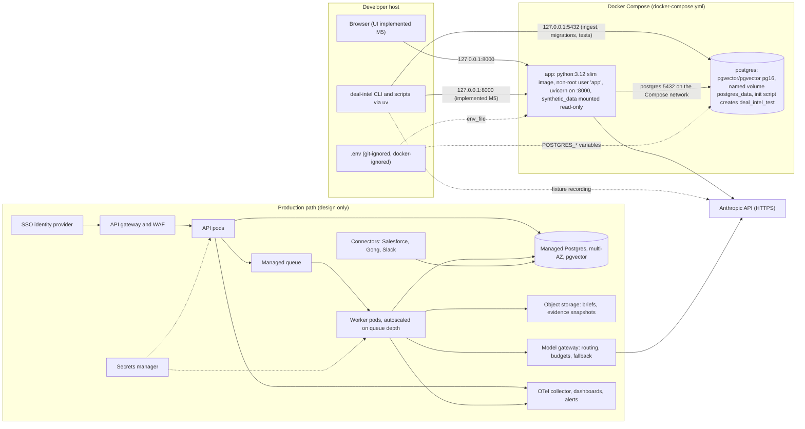

# Architecture

This document describes the Strategic Deal Intelligence Assistant as it is built. It is the reference design (`docs/reference/arch.md`) revised with the changes in `docs/PLAN.md` section 2 (C1 to C16). Where the two disagree, `docs/PLAN.md` wins.

Status markers: every section says whether it describes code that exists or design that has not landed yet.

- `> Status: implemented (Mx)` means the behaviour is in the repository and the cited modules can be read.
- `> Status: planned (Mx)` means the section is taken from `docs/PLAN.md` and must be checked against the code when milestone Mx lands.

At the time of writing, M0 to M6 are in the working tree. M7 live artifacts (recorded fixtures, measured cost and latency, SVG exports, screenshots) are not yet produced.

Companion documents: `docs/security.md` (threat model and controls). Diagram sources live in `docs/diagrams/*.mmd`; the copies embedded here must be kept in sync with them.

## 1. Purpose

The system takes an opportunity id and a requesting user id, retrieves only the evidence that user may see, runs three LLM agents over it, and produces a nine-section negotiation brief with citations. Recommendations touching pricing, legal terms, customer-facing language, low confidence, or missing data are routed to human approvers. Every step is traced and persisted so a brief can be inspected, replayed, and audited.

Principles kept from the reference design:

1. LLMs extract and synthesise; deterministic code owns permissions, retrieval filters, policy thresholds, validation, citations, state transitions, and rendering.
2. Deny by default, with one generic denial message.
3. Capability-based access: agents receive a retriever already bound to the requester's scope, and nothing else that can read evidence.
4. Typed Pydantic contracts with `extra="forbid"` at every boundary (`deal_intel/contracts/base.py`).
5. Evidence is untrusted data, framed and escaped before it reaches a model.
6. Numbers, dates, and identifiers in the deal snapshot are copied from source rows by code.
7. Fail visibly: a failed subagent produces a degraded brief with a warning; a failed run is resumable.

## 2. Changes from the reference design

| Id | Change | Where it lives |
|---|---|---|
| C1 | In-process executor instead of a job queue and worker | Planned (M4): `deal_intel/orchestration/executor.py`, `runner.py` |
| C2 | Own `Tracer` writing `trace_spans` instead of OTel and Jaeger | `deal_intel/observability/tracing.py`; table in migration `0004`; JSON export planned (M7); OTel exporter optional (M8) |
| C3 | Bounded read-only tool loop for conversation intelligence and strategy | `deal_intel/llm/tool_loop.py`, `deal_intel/agents/tools.py`, `tools=` in each `AgentSpec` |
| C4 | `PolicySummary` only when `scope.policies_allowed` | `policy_summary_for()` in `deal_intel/agents/strategy_context.py`; enforced again by `StrategyContext` in `deal_intel/contracts/agents/negotiation_strategy.py`. Policy engine for everyone: planned (M4) |
| C5 | Pricing-bearing Slack updates are `sensitive_pricing`; level at least the account minimum | `PRICING_KEYWORDS` and `validate_updates()` in `deal_intel/retrieval/slack_dataset.py` |
| C6 | Rewritten Slack updates checked against calls | `AUTHORED_UPDATES` in `deal_intel/retrieval/slack_dataset.py`; `tests/fixtures/slack_golden.json` |
| C7 | `fresh` bypasses cached outputs; keys include prompt hash and model config | `LlmRequest.fresh` (`deal_intel/contracts/llm.py`), `LlmClient.complete()`, `cache_key()` in `deal_intel/llm/keys.py`. Run idempotency key and `--fresh` flag: implemented (M4, M5) |
| C8 | Approvals with no eligible approver become `escalated` | Planned (M4): `deal_intel/policy/eligibility.py`, `engine.py` |
| C9 | Guardrail failures go through retry-with-feedback before drops | `complete_with_feedback()` and `salvage()` in `deal_intel/llm/retry.py`. Run-level failure rule: planned (M4) |
| C10 | Stakeholder map reads `salesforce`, `gong`, `slack` | `SPEC.source_types` in `deal_intel/agents/stakeholder_map.py` |
| C11 | Pricing visibility is `visible` or `none` | `PricingVisibility` in `deal_intel/contracts/agents/deal_snapshot.py` |
| C12 | One approval per subject and role; shared pricing-note approvals | Planned (M4): `deal_intel/policy/engine.py` |
| C13 | R7 also fires on missing source data | Planned (M4): `deal_intel/policy/facts.py`. Inputs exist: `degraded_inputs`, `AgentRun.tool_evidence_ids()`, `source_types_of()` |
| C14 | LLM work outside transactions; short persistence transactions | Planned (M4) for stages. Already true for `PostgresTracer`, `write_call()` (`deal_intel/llm/call_log.py`), and `deal_intel/llm/output_cache.py`, which each use their own short session |
| C15 | Plan specifies contracts and tests, not code | Process only; no code location |
| C16 | Conventional `.gitignore` | `.gitignore` |

## 3. Components

> Status: mixed. Solid boxes are implemented (M0 to M3); dashed boxes are planned, with the milestone in the label.

| Component | Module | Responsibility | Status |
|---|---|---|---|
| Permission gate | `deal_intel/permissions/gate.py` | Validates ids, looks up user, opportunity, account; returns `Allowed(AccessScope)` or `Denied` | implemented (M1) |
| Scope mirror | `deal_intel/permissions/scope.py` | Python version of the retriever's SQL predicates | implemented (M1) |
| Ingestion | `deal_intel/retrieval/ingest.py`, `chunkers/` | Chunks every source into `evidence_chunks` with access metadata | implemented (M1) |
| Scoped retriever | `deal_intel/retrieval/retriever.py` | `list`, `search`, `get`, `build_pack`, `evidence_hash`, all through one predicate builder | implemented (M1) |
| Deal snapshot tool | `deal_intel/agents/deal_snapshot.py` | Deterministic `DealSnapshot` from reference rows and scoped pricing chunks | implemented (M3) |
| Agent harness | `deal_intel/agents/base.py`, `scope_guard.py`, `tools.py` | Packs, scope assertion, framing, tools, model call, `AgentRun` record | implemented (M3, working tree) |
| Three agents | `deal_intel/agents/conversation_intelligence.py`, `stakeholder_map.py`, `negotiation_strategy.py` | Findings, stakeholder map, strategy | implemented (M3, working tree) |
| LLM client | `deal_intel/llm/client.py` and siblings | Routing, cache, tool loop, retry policy, cost, `llm_calls`, spans, fixtures | implemented (M2) |
| Generation-time guardrails | `deal_intel/guardrails/validators.py`, `wording.py`, `text.py`, `framing.py` | Citation, number, quote, name, approval-wording, customer-facing checks; evidence framing | implemented (M2, M3) |
| Tracing and logging | `deal_intel/observability/` | Spans in `trace_spans`, JSON logs, secret filter | implemented (M2) |
| Runner, executor, persistence | `deal_intel/orchestration/` | State machine, stages, resume | planned (M4) |
| Policy engine | `deal_intel/policy/` | Rules R1 to R7, approvals, eligibility, decisions | planned (M4) |
| Render checks, canaries | `deal_intel/guardrails/` (render checks, canaries) | Language lint, approval consistency, leakage scan | planned (M4) |
| Renderer | `deal_intel/rendering/` | `Brief`, Markdown, labels, versions, replay | planned (M4) |
| API, UI, CLI client | `deal_intel/api/`, `deal_intel/ui/`, `deal_intel/cli.py` | Interfaces over shared services | implemented (M5) |

## 4. Run state machine

> Status: planned (M4). No `runs`, `run_events`, or `stage_outputs` tables exist yet. Until M4, `deal_intel/agents/pipeline.py` runs the snapshot and the three agents in sequence for fixture recording and scenario tests.

Design from `docs/PLAN.md` M4:

- Stage order: authorize, retrieve, deal snapshot, conversation intelligence and stakeholder map in parallel (two threads, separate sessions), strategy, policy, guardrails, render.
- Each stage persists its output, a `run_events` row (append-only), and the new state in one short transaction; model work happens outside it (C14). `stage_outputs` is unique on run, stage, and attempt.
- Subagent failure marks the run degraded and continues. Strategy failure, `ScopeViolation`, or exceeding `RUN_INPUT_TOKEN_BUDGET` fails the run.
- Resume creates a new attempt and skips stages with successful outputs.
- Denied runs stop after authorize, write no retrieval rows, and store only the reason code in `run_events.detail`.
- The executor (C1) is a bounded `ThreadPoolExecutor` owned by the app lifespan; it refuses new runs above `DAILY_COST_BUDGET_USD`.

## 5. Data flow from request to brief

Each step names the code that does it today, or the milestone that adds it.

1. A client calls `POST /runs` with `{opportunity_id, user_id, fresh}`; the API creates a `QUEUED` run and submits it to the executor. Implemented (M5).
2. `AUTHORIZING`: `authorize()` in `deal_intel/permissions/gate.py` returns `Allowed(AccessScope)` or `Denied`. Implemented.
3. `RETRIEVING`: a `ScopedRetriever` is built from the scope; `evidence_hash()` fingerprints everything the scope can see; `build_agent_pack()` in `deal_intel/agents/base.py` builds one pack per agent and returns `RetrievalRecord`s. Implemented; persisting packs and the hash on the run is planned (M4).
4. `ANALYZING`: `build_deal_snapshot()` copies the opportunity, account, and in-scope pricing notes; conversation intelligence and stakeholder map run through `run_agent()`. Implemented (sequentially in `agents/pipeline.py`); parallel execution and stage persistence planned (M4).
5. `SYNTHESIZING`: `build_strategy_context()` assembles the snapshot, both subagent outputs (or `None` for a failed one), scope flags, degraded inputs, and the `PolicySummary` when allowed; `run_negotiation_strategy()` runs the strategy agent. Implemented.
6. `VALIDATING`: the policy engine creates approvals, render-time guardrails run, and the renderer writes brief version 1. Planned (M4).
7. `AWAITING_APPROVAL`: approvers decide through the UI or API; each decision re-renders a new brief version; the run completes when no `pending` approvals remain. Implemented (M5).
8. Reads of runs, briefs, and traces go through the read-time permission check. Implemented (M5).

## 6. Permission model

> Status: implemented (M1, M3) for the gate, scope, retriever, mirror, scope assertion, and tools. Read-time checks implemented (M5). Render-time canaries planned (M4).

**Gate.** `authorize(session, user_id, opportunity_id)` first runs `validate_identifiers()` (`USR-dddd`, `OPP-dddd`) and raises `InvalidInput` before any lookup. It then looks up the user, the opportunity, and its account, and calls the pure `decide(user, opportunity, account)`. Account membership is checked before restriction, so a user outside the account never learns it is also restricted. Reason codes are `UNKNOWN_USER`, `UNKNOWN_OPPORTUNITY`, `ACCOUNT_NOT_ALLOWED`, `RESTRICTED_ACCOUNT` (`DenialReason` in `deal_intel/contracts/access.py`). `Denied` holds only the reason code and the two ids the caller supplied; its `message` is the single `DENIED_MESSAGE`.

**AccessScope.** Built by `build_scope()`: `source_types` from the user's profile; `max_access_level` is `sensitive_pricing` if the user may view sensitive pricing, else `restricted` if they may view restricted accounts, else `standard`; `pricing_allowed`, `sensitive_pricing_allowed` (pricing allowed and sensitive pricing permitted), `policies_allowed`, `can_request_approval`. `AccessLevel` is ordered `standard < restricted < sensitive_pricing` with explicit comparison methods that refuse to compare against plain strings.

**Chunk access levels** are assigned at ingestion:

| Chunk kind | Access level |
|---|---|
| `sfdc_opp` | `restricted` if the account or the opportunity is restricted, else `standard` (`baseline_access_level()`) |
| `sfdc_account`, `contact` | the account's `access_level` |
| `gong_summary`, `transcript`, `slack` | the row's `source_access_level` |
| `pricing` | `sensitive_pricing` when `SensitivityRule.applies()`, else the baseline level |
| `policy` | `standard`, with no account |

`SensitivityRule` (`deal_intel/retrieval/sensitivity.py`) marks a pricing note sensitive when its opportunity is restricted, its approval status is not `not_required`, or its commercial risk is `high`; both values come from settings.

**Single scoped predicate builder.** `ScopedRetriever._scope_predicates()` is the only place a scope becomes SQL. Every statement carries: the active snapshot; the scope's account, or an accountless source type (`policies`); the scope's opportunity or no opportunity (account-level rows); source types intersected with the scope; access level in the permitted set; and, when sensitive pricing is not allowed, no `pricing` row at `sensitive_pricing`. No method takes an opportunity id. The constructor raises `TypeError` for anything but an `AccessScope`, including an `Allowed` wrapper or a `Denied`. `permissions/scope.py` expresses the same conditions in `chunk_is_in_scope()`; `tests/unit/test_retriever.py` checks that every row `list()` returns satisfies the Python predicate and that the predicate over the whole table selects exactly those rows.

**Scope assertion before every model call.** `run_agent()` calls `assert_pack_in_scope()` (`deal_intel/agents/scope_guard.py`) on the finished pack, held to the agent's own source types, before any evidence id reaches a span or any request reaches the model. Tool results pass `assert_chunks_in_scope()` before the model sees them. A violation raises `ScopeViolation` whose message carries counts only.

**Read-time checks.** Implemented (M5): the reader must be the requester, or a user whose own scope covers the account at the brief's `max_access_level`; unauthorised and unknown runs both return the same 404; traces are redacted for readers below the brief's level.

## 7. Retrieval and evidence packs

> Status: implemented (M1).

**Ingestion.** `deal-intel ingest` (`deal_intel/cli.py`) loads reference tables and evidence chunks in one transaction. `load_evidence()` builds a manifest (relative path to content hash) of every input file; the snapshot id is a prefix of the manifest hash, so unchanged inputs write nothing. Chunkers in `deal_intel/retrieval/chunkers/` produce one chunk per Salesforce row, Gong summary, pricing note, policy rule, and Slack update, and six-turn transcript windows with one-turn overlap. Contacts never carry email or phone. Chunk ids follow `<kind>:<source key>[:<segment>]` and citations follow `source=<file>, <id field>=<id>[, segment=<n>]` (`format_citation()` in `deal_intel/contracts/evidence.py`). The `evidence_chunks` table mirrors the current inputs; earlier manifests stay in `ingest_snapshots`.

**Search and scoring.** `search()` uses `websearch_to_tsquery` and `ts_rank_cd` over a generated `tsvector` column with a GIN index (migration `0003`). The final score (`deal_intel/retrieval/scoring.py`) is `lexical × reliability[kind] × (0.5 + 0.5 × recency)`, with `recency = 1 / (1 + days / 90)` measured from the latest in-scope event date rather than the wall clock, and undated rows treated as fully recent. Reliability weights are `Settings.reliability_weights`. Ties break by chunk id, so results are deterministic.

**Packs.** `build_pack()` lists every in-scope chunk for the agent's source types, runs the agent's fixed queries, places search hits in a tier above the baseline, and fills the token budget in that order (`deal_intel/retrieval/packing.py`), marking the pack `truncated` when anything was left out. Budgets are per agent in settings, in estimated tokens (four characters per token). Every `list`, `search`, and `get` returns a `RetrievalRecord` with the effective filters, returned ids, and scores. `evidence_hash()` hashes the sorted `(chunk_id, content_hash)` pairs of everything the scope can see, for the run idempotency key (planned M4).

**Hybrid retrieval.** The `embedding vector(1024)` column exists; `EMBEDDINGS_ENABLED` is not read by any code. Planned (M8).

## 8. Agents and the bounded tool loop

> Status: implemented (M3, working tree). Live fixtures for the three demo pairs are not recorded yet (`tests/fixtures/llm/` holds only test fixtures).

An agent is an `AgentSpec` (`deal_intel/agents/base.py`) plus a versioned prompt file under `deal_intel/agents/prompts/<agent>/v1.md`. `load_prompt()` returns the text and its SHA-256; the hash goes on every agent span and on `AgentRun`.

| Agent | Model role | Source types | Tools | Pack budget setting |
|---|---|---|---|---|
| Deal snapshot (no model) | none | `salesforce`, `pricing` via `retriever.list()` | none | none |
| Conversation intelligence | `extraction` | `gong`, `slack` | `search_evidence`, `get_evidence` | `budget_conversation_intelligence_tokens` |
| Stakeholder map | `extraction` | `salesforce`, `gong`, `slack` | none (single call) | `budget_stakeholder_map_tokens` |
| Negotiation strategy | `strategy` | all five, intersected with the scope | `search_evidence`, `get_evidence` | `budget_negotiation_strategy_tokens` |

**Harness.** `run_agent()` loads the prompt, builds or re-checks the pack, asserts scope, returns the agent's empty output with no model call when the pack is empty, builds the tools, and calls `LlmClient.complete()` with a check built from the agent's validators. The system prompt is the prompt file alone, so the cached prefix is identical across runs; the user message holds the task context (escaped with `escape_evidence_tags()`) and the framed chunks.

**Tools** (`deal_intel/agents/tools.py`). `search_evidence(query, source_types, k ≤ 8)` and `get_evidence(chunk_ids ≤ 8)` call the run's `ScopedRetriever`. Requested source types are intersected with the agent's, and the retriever intersects them again with the scope. An out-of-scope id and an unknown id produce the same "Not found" note. Each call appends a `RetrievalRecord`.

**Tool loop** (`deal_intel/llm/tool_loop.py`). The model may call tools until `MAX_TOOL_CALLS` calls are spent across the whole agent call, feedback retries included. After that, tools are withdrawn and a turn that still calls one raises `ToolBudgetExceeded`. Unknown tools and invalid arguments return an error result the model can correct. Every call is a `tool` span with the returned evidence ids; results are framed with `frame_tool_output()`. Chunks a tool returned count as citable evidence for that call only.

**Retry policy (C9)** (`deal_intel/llm/retry.py`). Schema errors and guardrail findings are sent back to the model as a feedback message, up to `llm_feedback_retries` times. After the last attempt, a schema error fails the call; guardrail findings are resolved by keeping the cleaned output (offending items dropped) only if it still validates against its contract and passes the checks again; otherwise `OutputNotSalvageable`. Over-long lists are truncated at parse time with a `bounds` warning instead of a retry. For the strategy agent, dropping summary sentences below three breaks `StrategyOutput`'s contract, which is how an unsalvageable executive summary surfaces; failing the run on it is planned (M4).

**Strategy context.** `build_strategy_context()` refuses a snapshot for another opportunity, passes `PolicySummary` (thresholds and legal-review tags from settings, no rule text) only when `scope.policies_allowed` (C4), and names failed subagents in `degraded_inputs`. `with_degraded_warnings()` adds a review warning for any degraded input the model did not name.

## 9. LLM client

> Status: implemented (M2).

`LlmClient` (`deal_intel/llm/client.py`) is the single entry point. `route_for()` maps `strategy` to `MODEL_STRATEGY` with adaptive thinking and `STRATEGY_EFFORT`, and `extraction` to `MODEL_EXTRACTION` with neither. `deal_intel/llm/anthropic_client.py` is the only module that imports the SDK; it records what was confirmed against the Anthropic docs: structured outputs through `output_config.format` with a JSON schema, adaptive thinking and effort on the strategy route only, strict tool definitions, `tool_choice: none` to withdraw tools (forced tool choice is rejected by the strategy model), refusal detection via `stop_reason`, and an opt-in server-side refusal fallback behind `llm_refusal_fallback` (off by default).

Other responsibilities: the output cache (`agent_output_cache`, keyed by agent, prompt hash, model, effort, and an input hash covering system prompt, user message, output schema, and tools; `fresh` skips the lookup but still stores); one `llm_calls` row per provider turn with `run_id` and `span_id`; cost from `Settings.model_prices_usd_per_mtok`, where an unpriced model raises `UnknownModelPrice` and settings refuse to load if a routed model has no price; fixture recording when `RECORD_FIXTURES=1`. `FakeLlmProvider` replays recorded turns by position, so tool loops and retries replay deterministically, and can force refusals for named agents.

## 10. Policy and approvals

> Status: planned (M4). The three threshold settings exist in `deal_intel/config.py` and are already shown to the strategy agent through `PolicySummary`, so the prompt and the engine read the same values.

Facts come from the strategy agent's next actions and from every permitted pricing note, evaluated independently of the agent's tags. Rules are data:

| Rule | Trigger | Required role | Effect |
|---|---|---|---|
| R1 | discount above `policy_discount_deal_desk_threshold_pct` | `deal_desk` | approval |
| R2 | discount above `policy_discount_sales_leader_threshold_pct` | `deal_desk`, `sales_leader` | approval per role |
| R3 | renewal uplift below `policy_renewal_uplift_floor_pct` | `deal_desk` | approval |
| R4 | liability cap change | `legal` | approval; no customer-facing language |
| R5 | legal terms, data retention, restricted research data | `legal` | approval; external language withheld |
| R6 | customer-facing concession language | none | suppressed until approved |
| R7 | low confidence, conflicting evidence, or missing source data (C13) | `human_reviewer` | review |

C13 extends R7 to degraded inputs and to actions whose citations are only subagent-derived with no primary chunk. C12 keys approvals by subject and role; an action citing a pricing note with the same discount shares that note's approval. Eligibility requires the role mapping, account membership, and an access level at least the brief's. When no user is eligible, the approval is `escalated` (C8) and the brief labels it prominently; the run completes when no `pending` approvals remain. Users with `can_request_approval = false` get labelled recommendations and no approval rows. `decide()` locks the row, checks eligibility, appends an `approval_events` row, re-renders, and completes the run when nothing is pending. An expiry sweep runs on API startup and before approvals are listed, using `APPROVAL_EXPIRY_HOURS`.

Brief labels: `[PENDING APPROVAL: <role>] INTERNAL ONLY`, `[APPROVED by <user> on <date>]`, `[REJECTED]`, `[ESCALATED: no eligible approver for <role>]`, `[APPROVAL EXPIRED]`, `[REQUIRES APPROVAL; you are not permitted to request it]`.

## 11. Guardrails

**At generation time.** Status: implemented (M2, M3). Validators in `deal_intel/guardrails/validators.py` are pure functions over the output and an `EvidenceIndex` (pack plus tool results). Findings feed the retry policy in section 8.

| Check (`GuardrailCheck`) | Applies to | Rule |
|---|---|---|
| `schema`, `bounds` | all | JSON parses; no undeclared fields; lists truncated to their bound with a warning |
| `citations` | all | every `evidence_ids` entry is in the pack or this call's tool results |
| `numbers` | findings, strategy | currency, scaled, percentage, and four-plus-digit figures match a cited chunk within the stated precision; ISO dates and bare years excluded |
| `quotes` | all | quotations of four or more words must be verbatim in a cited chunk, else unquoted into paraphrase |
| `names` | stakeholder map | names appear in evidence; `contact_id` has a chunk |
| `approval_wording` | strategy | no own-words assertion of approval (`deal_intel/guardrails/wording.py`); verified verbatim quotes are exempt |
| `customer_facing_leak` | strategy | a `customer_facing` action's text has no internal workflow terms |
| `degraded_inputs` | strategy | harness adds a warning for any unnamed degraded input |

Contracts add further refusals: vendor-side speakers cannot be stakeholders; a pricing or discount action must have `customer_facing = false`; a conflict needs at least two evidence ids; harness-only flags are absent from the model's schema and rejected if sent.

**At render time.** Status: planned (M4). Customer-facing language lint (concession phrases need an approved status; internal workflow terms never allowed); approval-consistency check; a canary set built from out-of-scope chunks; canary scans over rendered Markdown and JSON, denial payloads, API bodies, and span attributes. Leak incidents store a hash of the canary, never the value.

## 12. Tracing and persistence

> Status: implemented (M2) for spans, logs, `llm_calls`, and the output cache. Run, approval, and brief tables are planned (M4).

`Tracer` is a protocol with `NoopTracer` and `PostgresTracer` (`deal_intel/observability/tracing.py`). The current span is held in a context variable, so child spans find their parent and logs carry `run_id` and `span_id`. `PostgresTracer` inserts a row on start and updates it on end, each in its own short session; a failed write is dropped with one log line and never fails the traced work.

Span kinds (`SpanKind`): `run`, `stage`, `agent_call`, `llm_request`, `retrieval`, `tool`, `guardrail`, `approval`. Emitted today: `agent.<name>` (`agent_call`), `pack.<name>` (`retrieval`), `llm_request`, `tool.<name>`, and `guardrails`. `run`, `stage`, and `approval` spans are planned (M4). Attributes pass a whitelist (`SpanAttribute`); values must be numbers, booleans, or tokens matching `^[A-Za-z0-9_.:/-]+$` of at most 512 characters with no secret pattern, so no sentence of evidence can be stored.

| Table | Migration | Status |
|---|---|---|
| `users`, `accounts`, `opportunities`, `contacts`, `pricing_notes` | `0002` | implemented |
| `ingest_snapshots`, `evidence_chunks` (FTS, `vector(1024)`) | `0003` | implemented |
| `trace_spans`, `llm_calls`, `agent_output_cache` | `0004` | implemented |
| `runs`, `run_events`, `stage_outputs` | none yet | planned (M4) |
| `approvals`, `approval_events`, `briefs` | none yet | planned (M4) |

All SQL goes through SQLAlchemy with bound parameters.

## 13. Replay

> Status: planned (M4). `POST /runs/{id}/replay` renders a new brief version from stored stage outputs and approval state with zero model calls; replaying twice gives a byte-identical Markdown body. Replay depends on the deterministic pieces that exist today: validators with no I/O, deterministic retrieval ordering, and fixture replay through `FakeLlmProvider`.

## 14. Interfaces

Implemented: `GET /healthz`, `GET /readyz` (`deal_intel/api/routes/health.py`); CLI `deal-intel ingest`, `deal-intel generate-slack`, `deal-intel version`; `scripts/record_fixtures.py`, which refuses to run unless `RECORD_FIXTURES=1` and `LLM_CLIENT=anthropic`.

> Status: implemented (M5). `POST /runs`, `GET /runs/{id}`, `/brief?format=md|json`, `/trace`, `POST /runs/{id}/replay`, `POST /runs/{id}/resume`, `GET /approvals`, `POST /approvals/{id}/decision`. Server-rendered UI (Jinja2 with autoescaping, strict CSP, vendored HTMX, works without JavaScript) with a "Viewing as" user selector, new run, brief, approvals, and trace pages. CLI as a thin HTTP client: `generate`, `runs show|trace|replay|resume`, `approvals list|decide`, exit codes 0, 2, 3, 4, 5. Identity is a simulated input (`user_id`), not authentication.

## 15. Configuration

Settings are `deal_intel/config.py` (`pydantic-settings`, read from the environment and `.env`). `DATABASE_URL` has no default, so the app fails fast without it; `.env.example` holds local Compose URLs and placeholders only.

| Variable | Code default | Used by |
|---|---|---|
| `ANTHROPIC_API_KEY` | none (`SecretStr`) | `build_sdk_client()`; falls back to the SDK reading the environment |
| `DATABASE_URL`, `TEST_DATABASE_URL` | required, optional | `deal_intel/db/session.py`, `tests/conftest.py` |
| `MODEL_STRATEGY`, `MODEL_EXTRACTION` | `claude-opus-5-5`, `claude-haiku-4-5-20251001` | `route_for()` |
| `STRATEGY_EFFORT` | `high` | `route_for()` |
| `MAX_TOOL_CALLS` | `4` | `ToolLoop` |
| `RUN_INPUT_TOKEN_BUDGET` | `80000` | defined; enforced by the runner (planned M4) |
| `DAILY_COST_BUDGET_USD` | `20` | defined; enforced by the executor (planned M4) |
| `RUN_EXECUTOR_WORKERS` | `2` | defined; executor (planned M4) |
| `APPROVAL_EXPIRY_HOURS` | `168` | defined; policy engine (planned M4) |
| `EMBEDDINGS_ENABLED` | `false` | defined; hybrid retrieval (planned M8) |
| `LLM_CLIENT` | `anthropic` | `build_llm_client()`; `fake` for tests |
| `RECORD_FIXTURES` | `0` | `build_llm_client()`, `scripts/record_fixtures.py` |
| `APP_ENV`, `LOG_LEVEL` | `dev`, `INFO` | `LOG_LEVEL` in `deal_intel/api/main.py`; `APP_ENV` is not read yet |

Settings beyond `docs/PLAN.md` section 7: `MODEL_PRICES_USD_PER_MTOK` (JSON price table), `LLM_FEEDBACK_RETRIES`, `LLM_REFUSAL_FALLBACK`, `LLM_TIMEOUT_SECONDS`, `LLM_SDK_MAX_RETRIES`, `LLM_FIXTURES_ROOT`, `RELIABILITY_WEIGHTS`, `SEARCH_K`, the three `BUDGET_*_TOKENS` pack budgets, the three `POLICY_*` thresholds, `PRICING_NOT_REQUIRED_STATUS`, `PRICING_HIGH_RISK_LEVEL`, and `API_BASE_URL`.

## 16. Deployment

> Status: implemented (M0) for the Compose stack. The production path is design only.

The production path restores what C1 and C2 removed: a managed queue with workers instead of the in-process executor, and an OTel exporter behind the existing `Tracer` protocol. Identity comes from SSO; the gate is unchanged.

## 17. Measured values

Filled from `scripts/evaluate.py` and live runs. Values stay TBD until M7 records fixtures.

| Metric | Baseline | Source |
|---|---|---|
| Citation validity | TBD | `tests/fixtures/eval_baseline.json` |
| Grounded-number rate | TBD | same |
| Section completeness | TBD | same |
| Approval routing accuracy | TBD | same |
| Denial correctness | TBD | same |
| Degraded rate | TBD | same |
| Mean cost USD / tokens per brief | TBD | same |
| Guardrail drops by check | TBD | same |
| Cost per brief, by agent | TBD | measured in M7 |
| Run latency, end to end and per stage | TBD | measured in M7 |
| Tool calls per agent call | TBD | measured in M7 |
| Model routing (two-model vs single at low effort) | TBD | measured in M7 |
